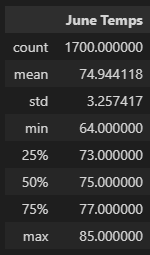
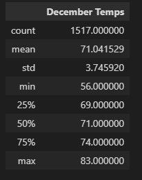

# Surf's Up Challenge

## Overview
Our employer is happy with the analysis we have provided but wants more information on two months on opposite ends of the year to make sure that their ice cream shop is sustainable. We will make two tables with a statistical analysis of June and December in order to gauge the consistancy of the weather.

## Results

- The temperature ranges in both months are around the same, December being a little colder but that is only during the days with the lowest temperatures.  
- The high temperatures are about the same for both months so they share the same range of temperatures, deviated only slightly.
- The averages for both months vary only by 3 degrees so comparatively the months share the same amount of hot day and cold days

## Summary: 
I believe that the ice cream shop should be consistent through out the year. Both months share the same highs and have about the same average temperature. Hot days will be in every month based on these results. Other factors we may want to consider when thinking on this topic are precipation and humidity. Both of these weather conditions can affect the temperature and the desire to go outside as both create discomfort and conditions that will make people change their minds.
